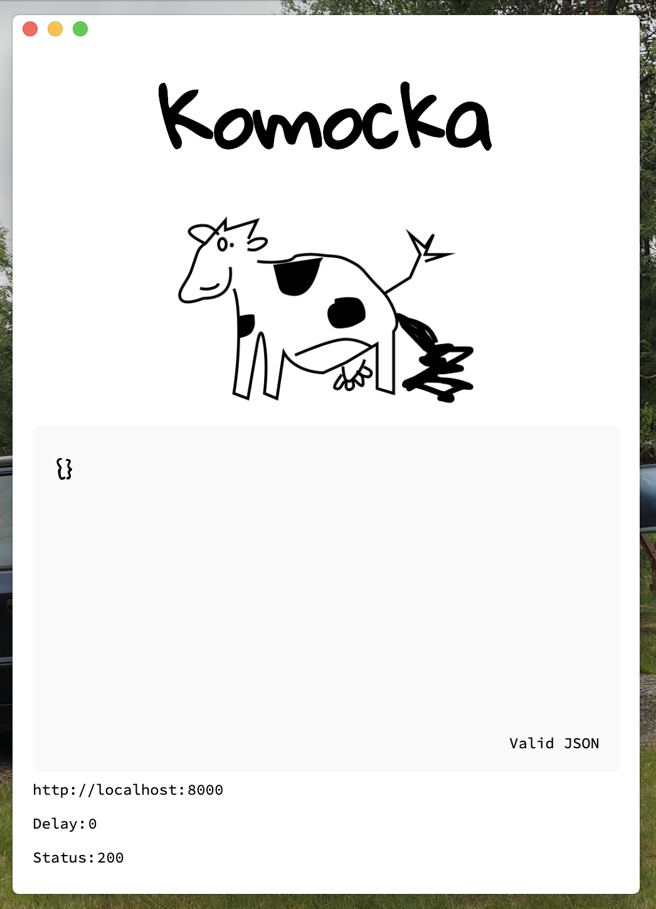

# Minimalistic API mock app

Are you a frontend developer who feels uncomfortable hardcoding all the response data in the beginning of your project? Do you ask yourself: "why not just do it the right way from the beginning?" and shortly after realize that its the backend teams fault? Do you feel slowed down by those API designing nerds that have no sense of style?

If yes, you've come to the right place!

Komocka is the must have developer tool for frontend developers who can't wait for the backend team to implement that basic API. Komocka provides a dead simple way to get server mock data as an http response in just a few seconds.

## Features
- Incredible art of cow pooping.
- Edit a json with parsing error message in the textarea.
- Drag and drop a json file to the ui to replace the current mock with the file contents.
- Simple auto format on textarea blur.
- Custom `port/endpoint` where the json mock should be served.
- Set http response status.
- Set a response delay.
- Simulate file uploads on endpoint `/file`.

## API
The json mock is served on `http://localhost:<port>/<endpoint>` (defaults to `http://localhost:8000`). Available methods are `GET`, `POST`, `PUT`, `DELETE`.

### File uploads
It is also possible to simulate file uploads on the endpoint `http://localhost:<port>/file`. Available methods are `POST`.

*A feature of storing files to serve later is under development.*

## Contribution
Please let me know if you have feedback or ideas how Komocka can improve. Easiest way is to put an issue. Thanks!
